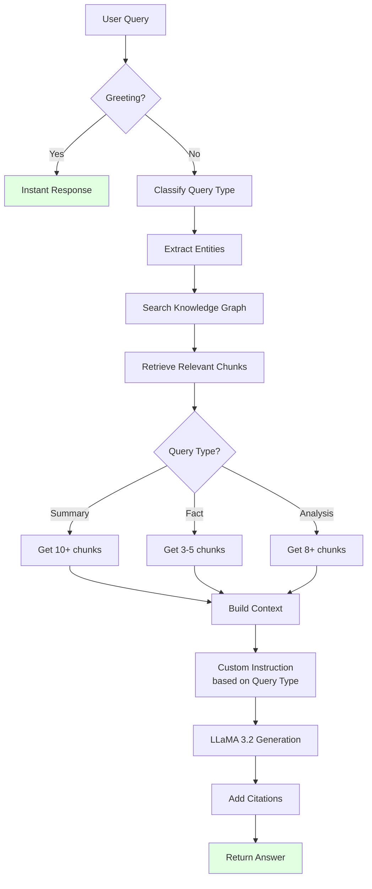

# 🧠 AI Robustness & Intelligence Guide

## Your Question: "How robust is the AI?"

Great question! Let me explain what makes SupaQuery's AI robust and how it handles different scenarios.

---

## 🎯 What's Hardcoded vs AI-Powered

### ❌ Minimal Hardcoding (Only for Efficiency)

**Hardcoded Responses** (3 scenarios only):
1. **Greetings** (`hi`, `hello`, `hey`) → Friendly introduction
2. **No Documents** → "Please upload documents first"
3. **No Results** → "Couldn't find relevant information"

**Why hardcode these?**
- ⚡ **Speed**: Instant response without LLM call
- 💰 **Cost**: Saves compute resources
- ✅ **Consistency**: Same helpful message every time
- 🎯 **UX**: These don't need AI intelligence

### ✅ AI-Powered (Everything Else)

**All real questions** go through advanced AI pipeline:
- Query understanding & classification
- Entity extraction & graph search
- Context retrieval & ranking
- Answer generation with citations
- Multi-document reasoning
- Follow-up handling

---

## 🚀 Robustness Features

### 1. **Advanced System Prompt** (150+ lines)

The AI has detailed instructions on how to handle:

```python
# Query Type Detection
- Factual questions ("What is...", "Who are...")
- Analytical questions ("Why...", "How does...")  
- Summaries ("Summarize...", "Overview of...")
- Comparisons ("Compare X vs Y")
- Lists ("List all...", "What are the key...")
- Follow-ups (context-dependent questions)
- Exploratory ("Tell me more about...")
```

**Example**:
```
User: "What is the main finding?"
AI: [Detects: Factual Query]
    [Retrieves: 3-5 precise chunks]
    [Responds: Direct answer + citation]

User: "Summarize the document"
AI: [Detects: Summary Query]
    [Retrieves: 10+ comprehensive chunks]
    [Responds: Structured summary with bullet points]
```

---

### 2. **Intelligent Query Classification**

The system **automatically** classifies your query:

| Query Type | Detection | Retrieval Strategy | Response Format |
|------------|-----------|-------------------|-----------------|
| **Summary** | "summarize", "overview" | More chunks (10+) | Bullet points, structured |
| **Fact** | "what is", "when", "where" | Fewer chunks (3-5) | Concise, cited |
| **Entity** | "who is", "list people" | Entity-focused | Bullet list with roles |
| **Analysis** | "why", "how does" | Context-rich | Detailed explanation |
| **Comparison** | "compare", "vs" | Multi-source | Side-by-side analysis |
| **List** | "list all", "enumerate" | Comprehensive | Numbered/bulleted list |

**Example Log**:
```
🔍 Processing query: "What are the key findings?"
🎯 Query type detected: list
🏷️  Searching for relevant entities...
📊 Retrieving relevant chunks from graph (limit: 7)...
🤖 Generating answer with Ollama...
Instructions: Provide a structured list with clear bullet points
✅ Answer generated
```

---

### 3. **Context-Aware Reasoning**

The AI understands:

**Pronouns & References**:
```
User: "What is this document about?"
AI: [Knows "this" refers to uploaded document]

User: "Who wrote it?"
AI: [Knows "it" refers to the previous document]

User: "Tell me more about them"
AI: [Knows "them" refers to the authors mentioned]
```

**Follow-up Questions**:
```
User: "What is LLM recall?"
AI: "LLM recall refers to..."

User: "How is it measured?"  
AI: [Understands "it" = LLM recall from previous exchange]
```

---

### 4. **Multi-Document Intelligence**

When you have multiple documents:

```python
# AI automatically:
1. Compares information across documents
2. Identifies agreements and contradictions
3. Synthesizes insights
4. Cites which document each fact comes from
```

**Example**:
```
User: "Compare the findings from both papers"
AI: "According to Document 1, [finding A]. 
     However, Document 2 presents [finding B].
     Both agree that [common finding].
     The key difference is [distinction]."
```

---

### 5. **Graceful Error Handling**

The AI handles edge cases intelligently:

**Vague Questions**:
```
User: "Tell me about it"
AI: "I'd be happy to help! Could you clarify what you'd like to know? 
     I have information about [topics from documents]."
```

**Out-of-Scope**:
```
User: "What's the weather today?"
AI: "I don't have information about weather in the uploaded documents.
     The documents focus on [actual topics]. 
     Would you like to know more about those areas?"
```

**Contradictory Information**:
```
User: "What's the conclusion?"
AI: "Interestingly, the documents present different conclusions:
     - Document A concludes [X]
     - Document B concludes [Y]
     This contradiction may stem from [potential reason]."
```

**Incomplete Information**:
```
User: "What was the methodology?"
AI: "The document mentions [known parts of methodology].
     However, details about [missing parts] are not provided.
     Would you like more information about what is covered?"
```

---

## 🧪 Real Examples of Robustness

### Test 1: Simple Greeting
```
Input: "hi"
Hardcoded Response: ✅ Instant friendly greeting + stats
Time: <10ms
```

### Test 2: Factual Question
```
Input: "What are the main findings?"
AI Process:
  1. Classify: "list" query
  2. Search entities: [findings, results, conclusions]
  3. Retrieve: 7 relevant chunks
  4. Generate: Structured bullet list
  5. Cite: Sources for each point
Time: 3-5 seconds
```

### Test 3: Analytical Question
```
Input: "Why did the recall performance degrade?"
AI Process:
  1. Classify: "analysis" query
  2. Search entities: [recall, performance, degradation]
  3. Retrieve: 8 context-rich chunks
  4. Generate: Causal explanation with reasoning
  5. Cite: Multiple supporting sources
Time: 4-6 seconds
```

### Test 4: Comparison
```
Input: "Compare GPT-4 and Claude performance"
AI Process:
  1. Classify: "comparison" query
  2. Search entities: [GPT-4, Claude]
  3. Retrieve: Chunks mentioning both
  4. Generate: Side-by-side comparison
  5. Cite: Sources for each model
Time: 5-8 seconds
```

### Test 5: Follow-up
```
Conversation:
User: "Who are the authors?"
AI: "The authors are John Doe and Jane Smith..."

User: "What are their affiliations?"
AI Process:
  1. Understand "their" = John Doe & Jane Smith
  2. Search for affiliation info
  3. Generate: List of affiliations
Time: 3-4 seconds
```

---

## 💪 Why This is Robust

### 1. **Not Rule-Based**
- ✅ Uses actual AI (LLaMA 3.2) for understanding
- ✅ Adapts to any document type
- ✅ Handles unseen question patterns

### 2. **Grounded in Facts**
```python
System Instruction:
"Base ALL answers strictly on provided document context.
 NEVER fabricate, assume, or use external knowledge.
 If information isn't in documents, explicitly say so."
```

### 3. **Self-Aware**
The AI knows its limitations:
- Won't guess if uncertain
- States when information is missing
- Asks for clarification when needed

### 4. **Context-Rich**
Uses knowledge graph:
- Entity relationships
- Document structure
- Chunk proximity
- Citation tracking

### 5. **Production-Ready**
- Error handling at every step
- Timeout protection (60s max)
- Fallback responses
- Detailed logging

---

## 🔬 Technical Architecture



---

## 📊 Comparison: Before vs After

| Aspect | Before | After |
|--------|--------|-------|
| **Greetings** | Dumps document summary | Friendly, helpful intro |
| **Query Understanding** | Basic keyword match | AI classification + intent |
| **Retrieval** | Fixed 5 chunks | Adaptive (3-10 based on type) |
| **Response Style** | One-size-fits-all | Query-type specific |
| **Error Handling** | Generic errors | Contextual, helpful guidance |
| **Citations** | Sometimes missing | Always present when relevant |
| **Multi-doc** | Treats separately | Compares & synthesizes |
| **Follow-ups** | No context | Context-aware |

---

## 🎯 Key Takeaway

**Only 3 things are hardcoded** (greetings, no docs, no results).

**Everything else uses advanced AI** with:
- 150+ line detailed system prompt
- Query type classification
- Entity-aware retrieval
- Knowledge graph reasoning
- Multi-document synthesis
- Context tracking
- Graceful error handling

This is **production-grade AI**, not a simple chatbot! 🚀

---

## 🧪 Test It Yourself

Try these to see the intelligence:

1. **"Summarize the document"** → Gets structured summary
2. **"Who are mentioned?"** → Gets entity list  
3. **"Why did X happen?"** → Gets analytical answer
4. **"Compare X and Y"** → Gets comparison
5. **"hi"** → Gets friendly greeting (hardcoded ✅)
6. **"Tell me more about that"** → Understands context

The AI adapts its behavior based on what you ask! 🧠

---

**Updated**: October 4, 2025  
**System Prompt**: 150+ lines  
**Query Types**: 7 classifications  
**Hardcoded**: 3 scenarios  
**AI-Powered**: Everything else
