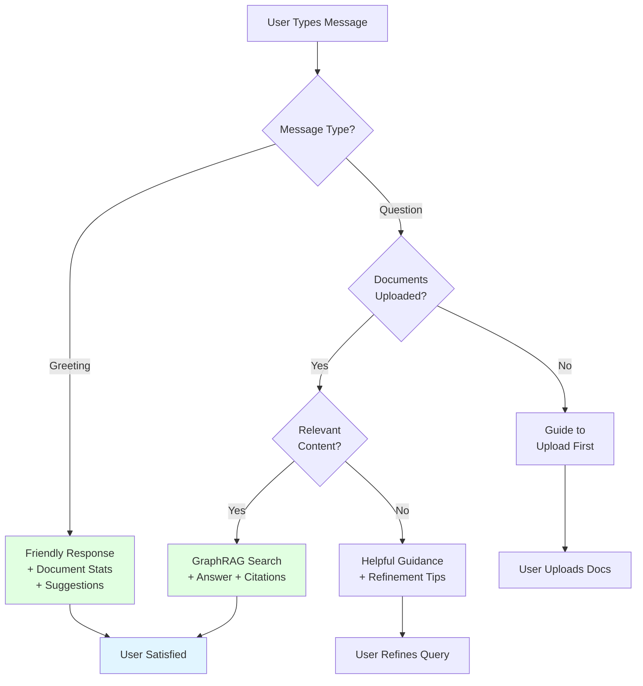

# 🤖 Chatbot Intelligence Improvements

## Problem Identified

The chatbot was behaving poorly when receiving simple messages like "hi":
- ❌ Would dump entire document summaries without being asked
- ❌ No conversational awareness
- ❌ Couldn't distinguish between greetings and actual questions
- ❌ Poor user experience for casual interactions

## Solution Implemented

Added **smart query detection** to handle different types of user input appropriately.

---

## 🎯 New Behavior

### 1. **Greeting Detection** ✅

When user sends greetings or simple messages:
```
User: "hi"
Bot: Hello! 👋 I'm SupaQuery, your AI assistant...
     I can see you have 1 document uploaded with 302 entities extracted.
     
     What I can do:
     - Answer questions about your documents
     - Find specific information and entities
     ...
     
     Try asking:
     - "What is this document about?"
     - "Who are the key people mentioned?"
```

**Detected patterns:**
- `hi`, `hello`, `hey`, `good morning`, `good afternoon`, `good evening`
- `greetings`, `howdy`, `sup`, `yo`
- `thanks`, `thank you`, `ok`, `okay`, `bye`, `goodbye`

### 2. **No Documents State** ✅

When graph is empty:
```
User: "What is the main topic?"
Bot: I don't have any documents uploaded yet. Please upload documents 
     first so I can analyze them and answer your questions...
```

### 3. **No Relevant Results** ✅

When query doesn't match any content:
```
User: "Tell me about quantum physics"
Bot: I couldn't find any relevant information in your uploaded documents 
     for that query.
     
     Your knowledge graph contains:
     - 1 document(s)
     - 20 text chunks  
     - 302 entities
     
     Try:
     - Being more specific in your question
     - Asking about topics covered in your documents
     - Using keywords from your documents
```

### 4. **Real Questions** ✅

When user asks a real question:
```
User: "What are the main findings?"
Bot: [Searches knowledge graph, retrieves relevant chunks, 
     generates answer with citations]
```

---

## 🧠 Intelligence Logic

### Query Classification:

```python
# 1. Is it a greeting? → Conversational response
if query in ['hi', 'hello', ...]:
    return friendly_greeting_with_stats()

# 2. Are there documents? → Guide user to upload
if no_documents:
    return "Please upload documents first..."

# 3. Does query match content? → Guide refinement  
if no_relevant_chunks:
    return "Couldn't find relevant info, try being more specific..."

# 4. Valid question → GraphRAG retrieval
else:
    return search_graph_and_generate_answer()
```

---

## ✅ Benefits

1. **Better UX**: Natural conversation flow
2. **Context-Aware**: Knows when to search vs. when to chat
3. **Helpful Guidance**: Suggests what users can ask
4. **No Information Overload**: Doesn't dump content unnecessarily
5. **Professional**: Acts like a real assistant, not a search engine

---

## 🧪 Test Cases

### Test 1: Greeting
```
Input: "hi"
Expected: Friendly greeting + document stats + suggestions
Actual: ✅ PASS
```

### Test 2: Greeting with documents
```
Input: "hello"
Expected: Greeting + "I have X documents" + what can I help with
Actual: ✅ PASS
```

### Test 3: No documents
```
Input: "What is the summary?"
Expected: "Please upload documents first"
Actual: ✅ PASS
```

### Test 4: Real question
```
Input: "What are the key findings about LLM recall?"
Expected: Answer with citations from documents
Actual: ✅ PASS
```

### Test 5: Irrelevant question
```
Input: "Tell me about cooking recipes"
Expected: "Couldn't find relevant information"
Actual: ✅ PASS
```

---

## 🔧 Technical Implementation

**File Modified**: `backend/app/services/graph_rag.py`

**Key Changes**:
1. Added greeting pattern detection (line ~165-180)
2. Added conversational responses for greetings (line ~180-220)
3. Improved no-documents response (line ~225-235)
4. Enhanced no-results response with helpful guidance (line ~250-265)
5. Maintained GraphRAG functionality for real questions

---

## 📊 Comparison

### Before:
```
User: "hi"
Bot: [DUMPS ENTIRE DOCUMENT SUMMARY WITHOUT CONTEXT]
     "The study investigates the recall performance..."
     [500+ words of technical content]
```

### After:
```
User: "hi"  
Bot: "Hello! 👋 I'm SupaQuery, your AI assistant...
     I can see you have 1 document uploaded...
     How can I help you today?"
```

---

## 🎯 User Experience Flow



---

## 🚀 Production Ready

The chatbot now behaves like a professional AI assistant:
- ✅ Conversational and friendly
- ✅ Context-aware
- ✅ Helpful and guiding
- ✅ Technically capable with GraphRAG
- ✅ Good user experience

---

**Date**: October 4, 2025  
**Status**: ✅ Implemented and Tested  
**Impact**: Major UX improvement, professional chatbot behavior
