# SupaQuery - Visual Workflow Diagrams for Presentations

This document contains visual workflow diagrams for presentations, documentation, and understanding the SupaQuery system architecture.

---

## 📊 Table of Contents

1. [Complete System Workflow](#1-complete-system-workflow)
2. [User Authentication Flow](#2-user-authentication-flow)
3. [Document Upload & Processing](#3-document-upload--processing)
4. [Knowledge Graph Construction](#4-knowledge-graph-construction)
5. [Chat Query Processing (GraphRAG)](#5-chat-query-processing-graphrag)
6. [Entity Extraction Pipeline](#6-entity-extraction-pipeline)
7. [RBAC Permission Flow](#7-rbac-permission-flow)
8. [Database Architecture](#8-database-architecture)
9. [Component Interaction](#9-component-interaction)
10. [Data Flow Diagram](#10-data-flow-diagram)

---

## 1. Complete System Workflow

```mermaid
graph TB
    subgraph "Client Layer"
        User([👤 User])
        Browser[🌐 Web Browser<br/>Next.js Frontend]
    end
    
    subgraph "Application Layer"
        API[⚡ FastAPI Backend<br/>Python 3.13]
        Auth[🔐 JWT Authentication]
        RBAC[👮 RBAC Engine]
        DocProc[📄 Document Processor<br/>PDF/DOCX/Image/Audio]
        GraphRAG[🧠 GraphRAG Service]
        EntityExt[🏷️ Entity Extractor<br/>spaCy NER]
    end
    
    subgraph "AI/ML Layer"
        Ollama[🤖 Ollama LLM<br/>llama3.2]
        SpaCy[📚 spaCy Model<br/>en_core_web_sm]
    end
    
    subgraph "Data Layer"
        Postgres[(🗄️ PostgreSQL<br/>Users, Metadata)]
        Memgraph[(🕸️ Memgraph<br/>Knowledge Graph)]
        Files[📁 File Storage<br/>Uploads]
    end
    
    User -->|1. Login/Register| Browser
    Browser -->|2. HTTP + JWT| API
    API -->|3. Verify Token| Auth
    Auth -->|4. Check Permissions| RBAC
    
    User -->|5. Upload Document| Browser
    Browser -->|6. POST /api/upload| API
    API -->|7. Save File| Files
    API -->|8. Process| DocProc
    DocProc -->|9. Extract Text| DocProc
    DocProc -->|10. Chunk Text| GraphRAG
    GraphRAG -->|11. Extract Entities| EntityExt
    EntityExt -->|12. NER| SpaCy
    GraphRAG -->|13. Build Graph| Memgraph
    API -->|14. Save Metadata| Postgres
    
    User -->|15. Ask Question| Browser
    Browser -->|16. POST /api/chat| API
    API -->|17. Query Graph| GraphRAG
    GraphRAG -->|18. Find Entities| Memgraph
    GraphRAG -->|19. Get Context| Memgraph
    GraphRAG -->|20. Generate Answer| Ollama
    Ollama -->|21. AI Response| GraphRAG
    GraphRAG -->|22. Return Answer| API
    API -->|23. JSON Response| Browser
    Browser -->|24. Display| User
    
    style User fill:#e1f5ff
    style Browser fill:#fff4e1
    style API fill:#ffe1f5
    style Ollama fill:#e1ffe1
    style Postgres fill:#f0e1ff
    style Memgraph fill:#ffe1e1
```



**Use Case**: Overall system architecture presentation slide

---

## 2. User Authentication Flow

```mermaid
sequenceDiagram
    participant U as 👤 User
    participant F as 🌐 Frontend
    participant A as ⚡ API
    participant DB as 🗄️ PostgreSQL
    participant JWT as 🔐 JWT Service
    
    U->>F: 1. Enter credentials
    F->>A: 2. POST /api/auth/login<br/>{username, password}
    
    A->>DB: 3. SELECT user WHERE username=?
    DB-->>A: 4. User record + hashed_password
    
    A->>A: 5. Verify password (bcrypt)
    
    alt Password Valid
        A->>JWT: 6. Generate JWT token
        JWT-->>A: 7. access_token
        A->>DB: 8. Load user roles & permissions
        DB-->>A: 9. Roles + Permissions
        A-->>F: 10. ✅ {access_token, user, roles}
        F->>F: 11. Store token in localStorage
        F-->>U: 12. ✅ Login successful → Dashboard
    else Password Invalid
        A-->>F: 13. ❌ 401 Unauthorized
        F-->>U: 14. ❌ Show error message
    end
    
    Note over F,A: All subsequent requests include<br/>Authorization: Bearer {token}
```



**Use Case**: Security and authentication explanation

---

## 3. Document Upload & Processing

```mermaid
flowchart TD
    Start([👤 User selects file]) --> Upload[📤 Upload to Frontend]
    Upload --> Validate{🔍 Validate<br/>File Type?}
    
    Validate -->|❌ Invalid| Error1[❌ Show Error:<br/>Unsupported file type]
    Validate -->|✅ Valid| CheckAuth{🔐 Authenticated?}
    
    CheckAuth -->|❌ No Token| Error2[❌ Redirect to Login]
    CheckAuth -->|✅ Has Token| SendAPI[📡 POST /api/upload<br/>with JWT token]
    
    SendAPI --> CheckPerm{👮 Has<br/>Permission?}
    CheckPerm -->|❌ No| Error3[❌ 403 Forbidden]
    CheckPerm -->|✅ Yes| SaveFile[💾 Save to /uploads/]
    
    SaveFile --> DetectType{📋 File Type?}
    
    DetectType -->|📕 PDF| ExtractPDF[📄 PyPDF2<br/>Extract text]
    DetectType -->|📘 DOCX| ExtractDOCX[📄 python-docx<br/>Extract text]
    DetectType -->|🖼️ Image| ExtractImage[🔍 Tesseract OCR<br/>Extract text]
    DetectType -->|🎵 Audio| ExtractAudio[🎤 Whisper<br/>Transcribe audio]
    
    ExtractPDF --> Chunk[✂️ Text Chunking<br/>512 chars, 50 overlap]
    ExtractDOCX --> Chunk
    ExtractImage --> Chunk
    ExtractAudio --> Chunk
    
    Chunk --> EntityExtraction[🏷️ Entity Extraction<br/>spaCy NER]
    EntityExtraction --> Entities[📊 Extract:<br/>PERSON, ORG, GPE,<br/>DATE, PRODUCT, etc.]
    
    Entities --> SavePostgres[(🗄️ Save Metadata<br/>PostgreSQL)]
    Entities --> BuildGraph[🕸️ Build Knowledge Graph]
    
    BuildGraph --> CreateNodes[➕ Create Nodes:<br/>Document, Chunks, Entities]
    CreateNodes --> CreateRels[🔗 Create Relationships:<br/>CONTAINS, MENTIONS]
    CreateRels --> SaveMemgraph[(🕸️ Save to<br/>Memgraph)]
    
    SaveMemgraph --> Success[✅ Upload Complete]
    Success --> Response[📨 Return success + stats]
    Response --> Display[📺 Display in UI]
    
    Error1 --> End([End])
    Error2 --> End
    Error3 --> End
    Display --> End
    
    style Start fill:#e1f5ff
    style Success fill:#e1ffe1
    style Error1 fill:#ffe1e1
    style Error2 fill:#ffe1e1
    style Error3 fill:#ffe1e1
    style SaveMemgraph fill:#fff4e1
    style SavePostgres fill:#f0e1ff
```



**Use Case**: Document processing pipeline explanation

---

## 4. Knowledge Graph Construction

```mermaid
graph LR
    subgraph "Input"
        Doc[📄 Document<br/>report.pdf]
    end
    
    subgraph "Processing"
        Chunk1[📝 Chunk 1:<br/>"Apple Inc announced..."]
        Chunk2[📝 Chunk 2:<br/>"The company revenue..."]
        Chunk3[📝 Chunk 3:<br/>"CEO Tim Cook said..."]
    end
    
    subgraph "Entities Extracted"
        E1[🏢 ORG:<br/>Apple Inc]
        E2[💰 MONEY:<br/>$100B]
        E3[👤 PERSON:<br/>Tim Cook]
        E4[📅 DATE:<br/>Q3 2024]
    end
    
    subgraph "Knowledge Graph"
        DN((📄 Document<br/>report.pdf))
        C1((📝 Chunk 1))
        C2((📝 Chunk 2))
        C3((📝 Chunk 3))
        EN1((🏢 Apple Inc))
        EN2((💰 $100B))
        EN3((👤 Tim Cook))
        EN4((📅 Q3 2024))
    end
    
    Doc -->|Split| Chunk1
    Doc -->|Split| Chunk2
    Doc -->|Split| Chunk3
    
    Chunk1 -->|spaCy NER| E1
    Chunk1 -->|spaCy NER| E4
    Chunk2 -->|spaCy NER| E1
    Chunk2 -->|spaCy NER| E2
    Chunk3 -->|spaCy NER| E3
    Chunk3 -->|spaCy NER| E1
    
    DN -.->|CONTAINS| C1
    DN -.->|CONTAINS| C2
    DN -.->|CONTAINS| C3
    
    C1 -.->|MENTIONS| EN1
    C1 -.->|MENTIONS| EN4
    C2 -.->|MENTIONS| EN1
    C2 -.->|MENTIONS| EN2
    C3 -.->|MENTIONS| EN3
    C3 -.->|MENTIONS| EN1
    
    EN1 -.->|RELATES_TO| EN3
    EN1 -.->|RELATES_TO| EN2
    
    style Doc fill:#e1f5ff
    style DN fill:#e1f5ff
    style EN1 fill:#ffe1e1
    style EN2 fill:#ffe1e1
    style EN3 fill:#ffe1e1
    style EN4 fill:#ffe1e1
```

**Use Case**: Knowledge graph concept explanation

---

## 5. Chat Query Processing (GraphRAG)

```mermaid
sequenceDiagram
    participant U as 👤 User
    participant F as 🌐 Frontend
    participant API as ⚡ Backend API
    participant GR as 🧠 GraphRAG
    participant EE as 🏷️ Entity Extractor
    participant MG as 🕸️ Memgraph
    participant LLM as 🤖 Ollama

    U->>F: 1. Type question:<br/>"What did Apple announce?"
    F->>API: 2. POST /api/chat<br/>{message, session_id}
    
    API->>GR: 3. Process query
    GR->>EE: 4. Extract entities from query
    EE-->>GR: 5. Entities: ["Apple"]
    
    GR->>MG: 6. MATCH (e:Entity {name: "Apple"})<br/><-[:MENTIONS]-(c:Chunk)
    MG-->>GR: 7. Return relevant chunks
    
    Note over GR: Build context from<br/>retrieved chunks
    
    GR->>GR: 8. Construct prompt:<br/>• System instructions<br/>• Retrieved context<br/>• User question
    
    GR->>LLM: 9. Generate answer with context
    Note over LLM: llama3.2 inference<br/>Temperature: 0.3<br/>Context: 2048 tokens
    LLM-->>GR: 10. Generated answer
    
    GR->>GR: 11. Build response:<br/>• Answer<br/>• Citations<br/>• Entities<br/>• Sources
    
    GR-->>API: 12. Complete response
    API-->>F: 13. JSON response
    F->>F: 14. Format & render
    F-->>U: 15. 💬 Display answer with citations
    
    Note over U,LLM: Total time: 3-10 seconds
```



**Use Case**: Query processing and AI integration flow

---

## 6. Entity Extraction Pipeline

```mermaid
flowchart LR
    subgraph "Input Text"
        Text["Apple Inc announced revenue of $100B in Q3 2024.<br/>CEO Tim Cook said the results exceeded expectations."]
    end
    
    subgraph "spaCy Processing"
        NER[🏷️ Named Entity Recognition]
        Tokenize[📝 Tokenization]
        POS[📌 POS Tagging]
    end
    
    subgraph "Entity Types"
        ORG[🏢 ORGANIZATION<br/>Apple Inc]
        MONEY[💰 MONEY<br/>$100B]
        DATE[📅 DATE<br/>Q3 2024]
        PERSON[👤 PERSON<br/>Tim Cook]
    end
    
    subgraph "Graph Storage"
        E1((🏢 Apple Inc<br/>type: ORG<br/>mentions: 1))
        E2((💰 $100B<br/>type: MONEY<br/>mentions: 1))
        E3((📅 Q3 2024<br/>type: DATE<br/>mentions: 1))
        E4((👤 Tim Cook<br/>type: PERSON<br/>mentions: 1))
    end
    
    Text --> Tokenize
    Tokenize --> POS
    POS --> NER
    
    NER --> ORG
    NER --> MONEY
    NER --> DATE
    NER --> PERSON
    
    ORG -->|Store| E1
    MONEY -->|Store| E2
    DATE -->|Store| E3
    PERSON -->|Store| E4
    
    E1 -.->|RELATES_TO| E4
    E1 -.->|RELATES_TO| E2
    
    style Text fill:#e1f5ff
    style NER fill:#fff4e1
    style E1 fill:#ffe1e1
    style E2 fill:#ffe1e1
    style E3 fill:#ffe1e1
    style E4 fill:#ffe1e1
```



**Use Case**: Entity extraction technical details

---

## 7. RBAC Permission Flow

```mermaid
flowchart TD
    Start([👤 User makes request]) --> HasToken{🔐 Has JWT<br/>Token?}
    
    HasToken -->|❌ No| Error1[❌ 401 Unauthorized<br/>Redirect to login]
    HasToken -->|✅ Yes| VerifyToken{🔍 Token<br/>Valid?}
    
    VerifyToken -->|❌ Expired/Invalid| Error2[❌ 401 Unauthorized<br/>Token expired]
    VerifyToken -->|✅ Valid| ExtractUser[📋 Extract user_id<br/>from token]
    
    ExtractUser --> LoadUser[(🗄️ Load User<br/>+ Roles + Permissions)]
    LoadUser --> CheckEndpoint{📍 Which<br/>endpoint?}
    
    CheckEndpoint -->|📤 Upload| CheckUpload{👮 Has<br/>documents:create?}
    CheckEndpoint -->|💬 Chat| CheckChat{👮 Has<br/>chat:create?}
    CheckEndpoint -->|🗑️ Delete| CheckDelete{👮 Has<br/>documents:delete?}
    CheckEndpoint -->|👥 Manage Users| CheckAdmin{👮 Is<br/>Admin?}
    
    CheckUpload -->|❌ No| Error3[❌ 403 Forbidden]
    CheckUpload -->|✅ Yes| AllowUpload[✅ Process upload]
    
    CheckChat -->|❌ No| Error3
    CheckChat -->|✅ Yes| AllowChat[✅ Process chat]
    
    CheckDelete -->|❌ No| Error3
    CheckDelete -->|✅ Yes| CheckOwner{👤 Is<br/>owner?}
    
    CheckOwner -->|❌ No| Error3
    CheckOwner -->|✅ Yes| AllowDelete[✅ Process delete]
    
    CheckAdmin -->|❌ No| Error3
    CheckAdmin -->|✅ Yes| AllowAdmin[✅ Process admin action]
    
    AllowUpload --> Success([✅ Request successful])
    AllowChat --> Success
    AllowDelete --> Success
    AllowAdmin --> Success
    
    Error1 --> End([End])
    Error2 --> End
    Error3 --> End
    Success --> End
    
    style Start fill:#e1f5ff
    style Success fill:#e1ffe1
    style Error1 fill:#ffe1e1
    style Error2 fill:#ffe1e1
    style Error3 fill:#ffe1e1
```



**Use Case**: Security and authorization explanation

---

## 8. Database Architecture

```mermaid
graph TB
    subgraph "PostgreSQL - Relational Data"
        Users[(👥 Users<br/>id, username, email,<br/>hashed_password)]
        Roles[(🎭 Roles<br/>id, name, description)]
        Permissions[(🔑 Permissions<br/>id, resource, action)]
        Documents[(📄 Documents<br/>id, user_id, filename,<br/>file_type, status)]
        UserRoles[(🔗 User-Roles<br/>user_id, role_id)]
        RolePerms[(🔗 Role-Permissions<br/>role_id, permission_id)]
    end
    
    subgraph "Memgraph - Graph Data"
        DocNode((📄 Document<br/>id, filename))
        ChunkNode((📝 Chunk<br/>id, text, index))
        EntityNode((🏷️ Entity<br/>name, type))
        
        DocNode -->|CONTAINS| ChunkNode
        ChunkNode -->|MENTIONS| EntityNode
        EntityNode -->|RELATES_TO| EntityNode
    end
    
    subgraph "File System"
        Uploads[📁 /uploads/<br/>Original files]
    end
    
    Users --> UserRoles
    Roles --> UserRoles
    Roles --> RolePerms
    Permissions --> RolePerms
    
    Users -.->|owns| Documents
    Documents -.->|references| Uploads
    Documents -.->|maps to| DocNode
    
    style Users fill:#f0e1ff
    style Documents fill:#f0e1ff
    style DocNode fill:#ffe1e1
    style ChunkNode fill:#ffe1e1
    style EntityNode fill:#ffe1e1
    style Uploads fill:#fff4e1
```



**Use Case**: Database architecture overview

---

## 9. Component Interaction

```mermaid
graph TB
    subgraph "Frontend - Next.js"
        UI[🎨 UI Components]
        Auth[🔐 Auth Context]
        API_Client[📡 API Client]
    end
    
    subgraph "Backend - FastAPI"
        Routes[🛣️ API Routes]
        Middleware[⚙️ Middleware<br/>CORS, Auth, RBAC]
        Services[🔧 Services Layer]
    end
    
    subgraph "Services"
        DocProc[📄 Document Processor]
        GraphRAG_Svc[🧠 GraphRAG Service]
        Entity_Svc[🏷️ Entity Extractor]
        Memgraph_Svc[🕸️ Memgraph Service]
        DB_Svc[🗄️ Database Service]
    end
    
    subgraph "External Services"
        Postgres[(🗄️ PostgreSQL)]
        Memgraph[(🕸️ Memgraph)]
        Ollama[🤖 Ollama]
        SpaCy[📚 spaCy]
    end
    
    UI <-->|HTTP/JSON| API_Client
    API_Client <-->|JWT Auth| Auth
    API_Client <-->|REST API| Routes
    
    Routes --> Middleware
    Middleware --> Services
    
    Services --> DocProc
    Services --> GraphRAG_Svc
    Services --> DB_Svc
    
    DocProc --> Entity_Svc
    GraphRAG_Svc --> Entity_Svc
    GraphRAG_Svc --> Memgraph_Svc
    
    Entity_Svc --> SpaCy
    Memgraph_Svc --> Memgraph
    GraphRAG_Svc --> Ollama
    DB_Svc --> Postgres
    
    style UI fill:#e1f5ff
    style Routes fill:#ffe1f5
    style Postgres fill:#f0e1ff
    style Memgraph fill:#ffe1e1
    style Ollama fill:#e1ffe1
```



**Use Case**: System component relationships

---

## 10. Data Flow Diagram

```mermaid
flowchart TB
    User([👤 User])
    
    subgraph "Upload Flow"
        direction TB
        U1[📤 Upload Document]
        U2[💾 Save File]
        U3[📄 Extract Text]
        U4[✂️ Chunk Text]
        U5[🏷️ Extract Entities]
        U6[🕸️ Build Graph]
        U7[✅ Upload Complete]
    end
    
    subgraph "Query Flow"
        direction TB
        Q1[💬 Ask Question]
        Q2[🔍 Extract Query Entities]
        Q3[🕸️ Search Graph]
        Q4[📦 Gather Context]
        Q5[🤖 Generate Answer]
        Q6[💬 Display Response]
    end
    
    subgraph "Storage"
        Files[(📁 Files)]
        DB[(🗄️ PostgreSQL)]
        Graph[(🕸️ Memgraph)]
    end
    
    User -->|1. Upload| U1
    U1 --> U2
    U2 --> Files
    U2 --> U3
    U3 --> U4
    U4 --> U5
    U5 --> U6
    U6 --> Graph
    U6 --> DB
    U6 --> U7
    U7 -->|Success| User
    
    User -->|2. Query| Q1
    Q1 --> Q2
    Q2 --> Q3
    Q3 --> Graph
    Graph --> Q4
    Q4 --> Q5
    Q5 --> Q6
    Q6 -->|Answer| User
    
    style User fill:#e1f5ff
    style Files fill:#fff4e1
    style DB fill:#f0e1ff
    style Graph fill:#ffe1e1
    style U7 fill:#e1ffe1
    style Q6 fill:#e1ffe1
```



**Use Case**: High-level data flow overview

---

## 🎯 How to Use These Diagrams

### For PowerPoint/Google Slides:

1. **Install Mermaid Plugin** (if available)
   - PowerPoint: Use "Mermaid Chart" add-in
   - Google Slides: Use "Mermaid Diagrams" extension

2. **Or Convert to Images:**
   ```bash
   # Using Mermaid CLI
   npm install -g @mermaid-js/mermaid-cli
   mmdc -i workflow.mmd -o workflow.png
   ```

3. **Or Use Online Tools:**
   - https://mermaid.live - Paste code, export as PNG/SVG
   - https://kroki.io - Generate diagrams via URL
   - https://www.diagrams.net - Import Mermaid syntax

### For Markdown/Documentation:

Simply paste the diagram code into your markdown file. GitHub, GitLab, and many documentation tools support Mermaid natively.

### For Presentations:

1. Copy the Mermaid code
2. Go to https://mermaid.live
3. Paste and render
4. Export as PNG or SVG (high quality)
5. Insert image into your presentation

---

## 📊 Diagram Legend

- **Circles** `(())` = Nodes in graph
- **Rectangles** `[]` = Processes/Actions
- **Cylinders** `[()]` = Databases
- **Diamonds** `{}` = Decision points
- **Arrows** `-->` = Data flow
- **Dotted arrows** `-.->` = Relationships
- **Colors**:
  - 🔵 Blue = User/Client layer
  - 🟡 Yellow = Processing/Services
  - 🟣 Purple = Relational database
  - 🔴 Red = Graph database
  - 🟢 Green = Success/AI

---

## 🎨 Customization Tips

### Change Colors:


### Add Icons:
Use emoji or Unicode characters:
- 👤 User: `&#128100;`
- 📄 Document: `&#128196;`
- 🔐 Lock: `&#128274;`
- 🧠 Brain: `&#129504;`

### Adjust Layout:
- `TB` = Top to Bottom
- `LR` = Left to Right
- `BT` = Bottom to Top
- `RL` = Right to Left

---

**All diagrams are ready for your presentations!** 🎉

Just copy-paste into Mermaid Live Editor or your presentation tool!
