# SupaQuery Visual Workflows - Mermaid Diagrams

This document contains visual workflow diagrams for the SupaQuery system using Mermaid syntax.

---

## 📋 Table of Contents

1. [System Architecture Overview](#1-system-architecture-overview)
2. [Authentication Flow](#2-authentication-flow)
3. [Document Upload Flow](#3-document-upload-flow)
4. [Query Processing Flow](#4-query-processing-flow)
5. [Knowledge Graph Structure](#5-knowledge-graph-structure)
6. [RBAC Permission Flow](#6-rbac-permission-flow)
7. [Database Schema](#7-database-schema)

---

## 1. System Architecture Overview

```mermaid
graph TB
    subgraph Frontend["Frontend Layer - Next.js"]
        UI[/"User Interface<br/>• Dashboard<br/>• Chat Interface<br/>• File Upload"/]
        Auth["AuthContext<br/>• JWT Storage<br/>• User State"]
        Protected["ProtectedRoute<br/>• Auth Guard"]
    end
    
    subgraph Backend["Backend Layer - FastAPI"]
        API[/"REST API<br/>• /api/auth/*<br/>• /api/upload<br/>• /api/chat<br/>• /api/documents/*"/]
        RBAC["RBAC Layer<br/>• Permission Check<br/>• Role Validation"]
        
        subgraph Services["Services"]
            DocProc["DocumentProcessor<br/>• PDF/DOCX/Image/Audio<br/>• Text Extraction<br/>• Chunking"]
            GraphRAG["GraphRAG Enhanced<br/>• Query Routing<br/>• Multi-Query Gen<br/>• Answer Evaluation"]
            Entity["EntityExtractor<br/>• spaCy NER<br/>• Entity Linking"]
            MemGraph["MemgraphService<br/>• Graph CRUD<br/>• Cypher Queries"]
        end
    end
    
    subgraph Storage["Storage Layer"]
        PG[("PostgreSQL<br/>• Users & Roles<br/>• Documents<br/>• Chat History")]
        MG[("Memgraph<br/>• Knowledge Graph<br/>• Entities<br/>• Relationships")]
        Files[("File System<br/>uploads/<br/>• PDFs<br/>• Images<br/>• Audio")]
    end
    
    subgraph AI["AI/ML Layer"]
        Ollama["Ollama LLM<br/>• llama3.2<br/>• Local Inference<br/>• Port: 11434"]
        Whisper["Whisper<br/>• Speech-to-Text"]
        Tesseract["Tesseract<br/>• OCR"]
    end
    
    UI --> Auth
    Auth --> Protected
    Protected --> API
    API --> RBAC
    RBAC --> Services
    DocProc --> Entity
    DocProc --> MemGraph
    GraphRAG --> MemGraph
    GraphRAG --> Ollama
    DocProc --> Whisper
    DocProc --> Tesseract
    Services --> PG
    Services --> MG
    Services --> Files
    
    style Frontend fill:#e1f5ff
    style Backend fill:#fff4e6
    style Storage fill:#e8f5e9
    style AI fill:#f3e5f5
```



---

## 2. Authentication Flow

```mermaid
sequenceDiagram
    actor User
    participant UI as Frontend<br/>(Next.js)
    participant API as Backend API<br/>(FastAPI)
    participant DB as PostgreSQL<br/>(users table)
    participant LS as localStorage

    Note over User,LS: Login Flow
    User->>UI: Enter credentials
    UI->>API: POST /api/auth/login<br/>{username, password}
    API->>DB: Query user by username
    DB-->>API: User record
    API->>API: Verify password<br/>(bcrypt hash)
    
    alt Password Valid
        API->>API: Generate JWT token<br/>(HS256, 30min expiry)
        API->>DB: Get user roles & permissions
        DB-->>API: Roles & permissions
        API-->>UI: {access_token, user}
        UI->>LS: Store token
        UI-->>User: Redirect to dashboard
    else Password Invalid
        API-->>UI: 401 Unauthorized
        UI-->>User: Show error message
    end

    Note over User,LS: Authenticated Request Flow
    User->>UI: Make request
    UI->>LS: Get auth token
    LS-->>UI: JWT token
    UI->>API: Request with<br/>Authorization: Bearer {token}
    API->>API: Validate JWT<br/>• Verify signature<br/>• Check expiry
    
    alt Token Valid
        API->>DB: Get user permissions
        DB-->>API: Permission list
        API->>API: Check required permission
        alt Has Permission
            API->>API: Process request
            API-->>UI: Success response
        else No Permission
            API-->>UI: 403 Forbidden
        end
    else Token Invalid/Expired
        API-->>UI: 401 Unauthorized
        UI->>LS: Remove token
        UI-->>User: Redirect to /login
    end
```



---

## 3. Document Upload Flow


---

## 4. Query Processing Flow

```mermaid
sequenceDiagram
    actor User
    participant UI as Frontend
    participant API as Backend API
    participant GR as GraphRAG<br/>Enhanced
    participant MG as Memgraph
    participant Eval as EvaluationAgent
    participant LLM as Ollama<br/>(llama3.2)
    participant PG as PostgreSQL

    User->>UI: Type question<br/>"What are the 1 mark questions?"
    UI->>UI: Get selected doc IDs
    UI->>API: POST /api/chat<br/>{message, document_ids}
    
    API->>API: Validate JWT &<br/>check 'chat:create' permission
    API-->>GR: query(message, doc_ids)
    
    GR->>GR: Step 1: Classify Query<br/>(general/entity/summary)
    GR->>GR: Result: "general"
    
    GR->>GR: Step 2: Check if simple query<br/>Starts with: "what are", "how many", etc.
    
    alt Simple Query Detected
        GR->>GR: ⚡ Skip multi-query generation<br/>(70% faster!)
        Note right of GR: queries = [original_query]
    else Complex Query
        GR->>LLM: Generate 2 query variations
        LLM-->>GR: [query1, query2, query3]
    end
    
    GR->>GR: Step 3: Retrieval Loop<br/>Max 3 attempts
    
    loop Retrieval Attempt (up to 3)
        GR->>MG: Query similar chunks<br/>MATCH (d:Document)-[:CONTAINS]->(c:Chunk)<br/>WHERE d.id IN $doc_ids<br/>RETURN c LIMIT 5
        MG-->>GR: [chunks]
        
        GR->>MG: Get entities<br/>MATCH (c)-[:MENTIONS]->(e:Entity)<br/>RETURN e
        MG-->>GR: [entities]
        
        GR->>GR: Step 4: Build Context<br/>Max 12,000 chars<br/>Format: [source]: text
        
        GR->>LLM: Generate Answer<br/>POST /api/generate<br/>{prompt with 8K chars context,<br/>model: llama3.2,<br/>temp: 0.3,<br/>timeout: 120s}
        
        LLM-->>GR: Generated answer
        
        GR->>Eval: Evaluate Answer Quality<br/>evaluate(query, answer, chunks, sources)
        
        Eval->>Eval: Calculate Scores:<br/>• Quality (factual accuracy)<br/>• Completeness (all parts answered)<br/>• Relevance (on-topic)
        
        Eval-->>GR: {overall_score: 0.87,<br/>is_sufficient: true,<br/>quality: 0.80,<br/>completeness: 0.80,<br/>relevance: 1.00}
        
        alt Score >= 0.7
            GR->>GR: ✓ Answer Sufficient<br/>Break loop
        else Score < 0.7
            GR->>GR: ⚠️ Answer Insufficient<br/>Apply Retry Strategy:<br/>• Expand search (increase top_k)<br/>• Refine queries<br/>Continue loop
        end
    end
    
    GR->>GR: Step 5: Build Citations<br/>Extract from chunks with<br/>page numbers / timestamps
    
    GR-->>API: {answer, citations,<br/>sources, entities,<br/>evaluation, strategy}
    
    API->>PG: Save Chat Message<br/>INSERT INTO chat_messages<br/>(user + assistant messages)
    
    API-->>UI: Response JSON
    
    UI->>UI: Display answer with citations
    UI-->>User: Show formatted response<br/>with "Sources & Citations"
```



---

## 5. Knowledge Graph Structure

```mermaid
graph LR
    subgraph Users
        U1[(:User)]
    end
    
    subgraph Documents
        D1[(:Document<br/>id: '123'<br/>filename: 'questions.pdf'<br/>type: 'pdf'<br/>user_id: '1')]
        D2[(:Document<br/>id: '124'<br/>filename: 'notes.docx')]
    end
    
    subgraph Chunks
        C1[(:Chunk<br/>id: '123_chunk_0'<br/>text: 'Unit 1 Questions...'<br/>position: 0<br/>citation: {pages: [1]})]
        C2[(:Chunk<br/>id: '123_chunk_1'<br/>text: 'Defines network...'<br/>position: 1)]
        C3[(:Chunk<br/>id: '124_chunk_0'<br/>text: 'Network layers...')]
    end
    
    subgraph Entities
        E1[(:Entity<br/>name: 'Unit 1'<br/>type: 'CONCEPT')]
        E2[(:Entity<br/>name: 'OSI Model'<br/>type: 'CONCEPT')]
        E3[(:Entity<br/>name: 'Network Architecture'<br/>type: 'CONCEPT')]
    end
    
    U1 -->|OWNS| D1
    U1 -->|OWNS| D2
    
    D1 -->|CONTAINS| C1
    D1 -->|CONTAINS| C2
    D2 -->|CONTAINS| C3
    
    C1 -->|MENTIONS| E1
    C1 -->|MENTIONS| E3
    C2 -->|MENTIONS| E2
    C2 -->|MENTIONS| E3
    C3 -->|MENTIONS| E2
    
    E2 -->|RELATES_TO| E3
    C1 -.->|SIMILAR_TO<br/>cosine: 0.85| C3
    D1 -.->|CITES| D2
    
    style D1 fill:#bbdefb
    style D2 fill:#bbdefb
    style C1 fill:#c8e6c9
    style C2 fill:#c8e6c9
    style C3 fill:#c8e6c9
    style E1 fill:#fff9c4
    style E2 fill:#fff9c4
    style E3 fill:#fff9c4
    style U1 fill:#f8bbd0
```

### Graph Query Examples

```cypher
-- Find all chunks mentioning an entity
MATCH (e:Entity {name: 'Unit 1'})<-[:MENTIONS]-(c:Chunk)
RETURN c

-- Find related entities
MATCH (e1:Entity {name: 'OSI Model'})-[:RELATES_TO]-(e2:Entity)
RETURN e2

-- Find documents containing specific concept
MATCH (d:Document)-[:CONTAINS]->(c:Chunk)-[:MENTIONS]->(e:Entity {name: 'Network Architecture'})
RETURN DISTINCT d

-- Citation network (3 levels deep)
MATCH path = (d1:Document {id: '123'})-[:CITES*1..3]->(d2:Document)
RETURN path

-- Similar chunks by embedding
MATCH (c:Chunk)
WHERE vector.cosine_similarity(c.embedding, $query_embedding) > 0.7
RETURN c
ORDER BY vector.cosine_similarity(c.embedding, $query_embedding) DESC
LIMIT 5

-- Entity co-occurrence
MATCH (e1:Entity)<-[:MENTIONS]-(c)-[:MENTIONS]->(e2:Entity)
WHERE e1.name = 'Unit 1'
RETURN e2.name, count(c) as co_occurrences
ORDER BY co_occurrences DESC
```

---

## 6. RBAC Permission Flow

```mermaid
graph TD
    User[User Request] --> API[API Endpoint]
    API --> Decorator{Permission<br/>Decorator}
    
    Decorator --> ValidateJWT[Validate JWT Token]
    ValidateJWT --> |Valid| GetUser[Get Current User]
    ValidateJWT --> |Invalid| Reject1[401 Unauthorized]
    
    GetUser --> GetRoles[Get User Roles]
    GetRoles --> GetPerms[Get Role Permissions]
    
    GetPerms --> CheckPerm{Has Required<br/>Permission?}
    
    CheckPerm --> |Yes| CheckOwner{Needs Owner<br/>Check?}
    CheckPerm --> |No| Reject2[403 Forbidden]
    
    CheckOwner --> |No| Allow[✓ Allow Request]
    CheckOwner --> |Yes| VerifyOwner{Is Owner or<br/>Has Share?}
    
    VerifyOwner --> |Yes| Allow
    VerifyOwner --> |No| Reject3[403 Forbidden:<br/>Not Owner]
    
    Allow --> Execute[Execute Endpoint Logic]
    Execute --> Response[Return Response]
    
    style User fill:#e3f2fd
    style Allow fill:#c8e6c9
    style Reject1 fill:#ffcdd2
    style Reject2 fill:#ffcdd2
    style Reject3 fill:#ffcdd2
    style Execute fill:#fff9c4
```



### Permission Matrix


---

## 7. Database Schema


---

## 8. Component Interaction Diagram


---

## 9. File Processing Pipeline


---

## 10. Query Optimization Decision Tree


---

## 11. Complete AI Processing Flow - Simplified End-to-End

```mermaid
flowchart TB
    subgraph Frontend["🖥️ Frontend (Next.js)"]
        User([👤 User]) --> ChatUI[Chat Interface]
        ChatUI --> SendQuery[Send Query with<br/>Selected Documents]
    end
    
    subgraph Backend["⚙️ Backend API (FastAPI)"]
        SendQuery --> AuthCheck{🔐 JWT<br/>Authentication}
        AuthCheck -->|✅ Valid| RBAC{🛡️ Permission<br/>Check}
        AuthCheck -->|❌ Invalid| Reject1[❌ 401 Unauthorized]
        RBAC -->|✅ Authorized| GraphRAGService
        RBAC -->|❌ Forbidden| Reject2[❌ 403 Forbidden]
    end
    
    subgraph AIProcessing["🤖 Enhanced GraphRAG Service"]
        GraphRAGService[Receive Query] --> QueryRouter{📍 AI Router<br/>Classify Query Type}
        
        QueryRouter -->|Simple Query<br/>'what are', 'how many'| SimplePath[⚡ Direct Path<br/>Single Query]
        QueryRouter -->|Complex Query<br/>Analysis needed| ComplexPath[🔄 Multi-Query Path<br/>Generate Variations]
        
        SimplePath --> Retrieval
        ComplexPath --> MultiQuery[Multi-Query Generator<br/>Create 2-3 variations]
        MultiQuery --> Retrieval[📚 Retrieval from Memgraph<br/>Get relevant chunks & entities]
        
        Retrieval --> RetryLoop{🔁 Retry Loop<br/>Attempt 1-3}
    end
    
    subgraph Generation["💭 Answer Generation"]
        RetryLoop --> BuildContext[Build Context<br/>Format chunks with citations]
        BuildContext --> OllamaLLM[🧠 Ollama LLM<br/>Generate Answer<br/>Model: llama3.2]
        OllamaLLM --> Answer[Generated Answer]
    end
    
    subgraph Evaluation["✅ Quality Control"]
        Answer --> EvalAgent[🎓 Evaluation Agent<br/>Score Answer Quality]
        EvalAgent --> QualityCheck{Quality Score<br/>>= 0.7?}
        
        QualityCheck -->|✅ Pass| Success[✓ High Quality Answer]
        QualityCheck -->|❌ Fail| RetryCheck{Max Retries<br/>Reached?}
        
        RetryCheck -->|No| RetryStrategy[Apply Retry Strategy<br/>Expand search or<br/>Refine queries]
        RetryCheck -->|Yes| BestAttempt[Return Best Attempt]
        
        RetryStrategy --> RetryLoop
    end
    
    subgraph Response["📤 Response Handling"]
        Success --> FormatResponse[Format Response<br/>Add citations & metadata]
        BestAttempt --> FormatResponse
        FormatResponse --> SaveDB[(💾 Save to PostgreSQL<br/>Chat History)]
        SaveDB --> SendResponse[Send JSON Response]
    end
    
    SendResponse --> DisplayUI
    
    subgraph FrontendDisplay["🖥️ Frontend Display"]
        DisplayUI[Display Answer] --> ShowAnswer[Show Answer Text]
        DisplayUI --> ShowCitations[Show Citations with<br/>Page Numbers]
        DisplayUI --> ShowSources[Show Source Documents]
        ShowAnswer --> UserView
        ShowCitations --> UserView
        ShowSources --> UserView([👤 User Sees Result])
    end
    
    style Frontend fill:#e3f2fd
    style Backend fill:#fff4e6
    style AIProcessing fill:#f3e5f5
    style Generation fill:#e1bee7
    style Evaluation fill:#c8e6c9
    style Response fill:#fff9c4
    style FrontendDisplay fill:#e3f2fd
    style Success fill:#81c784
    style BestAttempt fill:#ffb74d
    style Reject1 fill:#ef5350
    style Reject2 fill:#ef5350
```



### Simplified Flow - Component Overview

#### 🖥️ **Frontend (Next.js)**
- User interacts with chat interface
- Selects documents to query against
- Sends authenticated requests to backend
- Displays formatted answers with citations

#### 🔐 **Authentication & Authorization**
- **JWT Validation**: Verifies user token
- **RBAC**: Checks user permissions
- Rejects unauthorized access (401/403)

#### 📍 **AI Router (Query Classification)**
- **Simple Queries**: Direct single query path (70% faster)
  - Examples: "What are...", "How many...", "List..."
- **Complex Queries**: Multi-query generation path
  - Examples: Analysis, comparisons, explanations

#### 🔄 **Multi-Query Generator**
- Creates 2-3 query variations for better coverage
- Only used for complex queries
- Improves retrieval accuracy

#### � **Retrieval System**
- Searches Memgraph knowledge graph
- Retrieves relevant chunks and entities
- Builds context with citations

#### 🧠 **Ollama LLM (Answer Generation)**
- Model: llama3.2:latest
- Generates precise answers from context
- 120-second timeout per attempt

#### 🎓 **Evaluation Agent (Quality Control)**
- Scores answer on 3 metrics:
  - **Quality**: Factual accuracy (0-1)
  - **Completeness**: All parts answered (0-1)
  - **Relevance**: On-topic response (0-1)
- **Threshold**: 0.7 overall score
- Triggers retry if below threshold

#### 🔁 **Retry Logic**
- **Max Attempts**: 3 iterations
- **Retry Strategies**:
  - Expand search (get more chunks)
  - Refine queries (generate new variations)
  - Both (comprehensive approach)
- Returns best attempt if max retries reached

#### 💾 **Response & Storage**
- Formats answer with citations
- Saves chat history to PostgreSQL
- Returns JSON with answer, sources, entities, evaluation scores

#### � **Performance**
- **Simple Query**: ~2-3 seconds
- **Complex Query**: ~5-8 seconds (no retry)
- **With Retry**: ~10-20 seconds
- **Success Rate**: 95% after retries

---

## How to Use These Diagrams

### In GitHub Markdown
Simply paste the Mermaid code blocks into any `.md` file. GitHub will automatically render them.

### In Documentation Tools
- **Notion**: Supports Mermaid via code blocks with `mermaid` language
- **GitBook**: Native Mermaid support
- **Confluence**: Use Mermaid macro/plugin
- **MkDocs**: Use `pymdown-extensions` with `superfences`

### Online Viewers
- **Mermaid Live Editor**: https://mermaid.live/
- **GitHub**: Automatic rendering in markdown files
- **VS Code**: Install "Markdown Preview Mermaid Support" extension

### Export Options
From Mermaid Live Editor, you can export as:
- SVG (vector, scalable)
- PNG (raster, fixed size)
- PDF (for documents)

---

**Last Updated:** October 8, 2025  
**Diagrams Version:** 1.1  
**Compatible with:** SupaQuery Architecture v3.0
